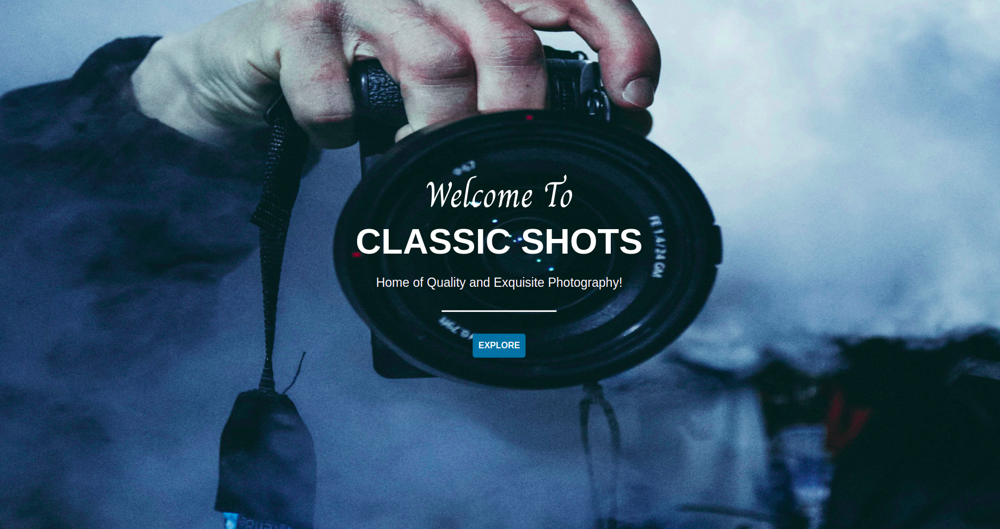

# Classic-Shots

## Project Description
This is a personal gallery application that displays photos for others to see and interact with through a photo modal. Users are able to filter images based on the location they were taken as well as search for images based on their various categories. On the other hand, the images are added, updated and deleted through a separate admin dashboard.

## Author
- [Shalyne Waweru](https://github.com/Shalyne-Waweru)
- Email: shalynewaweru@gmail.com

## Figma Design Link
- [Get a sneak peak](https://www.figma.com/file/YwNrWpOFHWYE1vni4UABUV/Classic-Shots?node-id=0%3A1)

## Website Live Link
- [Check it out here](https://classic-shots.herokuapp.com/)

## User Stories
A user will be able to:

- View different photos that interest him/her.
- Click on a single photo to expand it and also view the details of the photo on a modal
- Search for different categories of photos. (ie. Travel, Food)
- Copy a link to the photo to share with his/her friends.
- View photos based on the location they were taken.

## Technologies Used
- HTML
- CSS
- Bootstrap
- Javascript
- jQuery
- Python (Flask)
- PostgreSQL

## Project Setup Instructions

To start using this project use the following commands:

- git clone `https://github.com/Shalyne-Waweru/Classic-Shots.git`
- `cd Classic-Shots`
- run `python3.8 manage.py runserver` to serve the application

## License info
MIT License

Copyright (c) 2022 Shalyne Waweru

Permission is hereby granted, free of charge, to any person obtaining a copy
of this software and associated documentation files (the "Software"), to deal
in the Software without restriction, including without limitation the rights
to use, copy, modify, merge, publish, distribute, sublicense, and/or sell
copies of the Software, and to permit persons to whom the Software is
furnished to do so, subject to the following conditions:

The above copyright notice and this permission notice shall be included in all
copies or substantial portions of the Software.

THE SOFTWARE IS PROVIDED "AS IS", WITHOUT WARRANTY OF ANY KIND, EXPRESS OR
IMPLIED, INCLUDING BUT NOT LIMITED TO THE WARRANTIES OF MERCHANTABILITY,
FITNESS FOR A PARTICULAR PURPOSE AND NONINFRINGEMENT. IN NO EVENT SHALL THE
AUTHORS OR COPYRIGHT HOLDERS BE LIABLE FOR ANY CLAIM, DAMAGES OR OTHER
LIABILITY, WHETHER IN AN ACTION OF CONTRACT, TORT OR OTHERWISE, ARISING FROM,
OUT OF OR IN CONNECTION WITH THE SOFTWARE OR THE USE OR OTHER DEALINGS IN THE
SOFTWARE.
